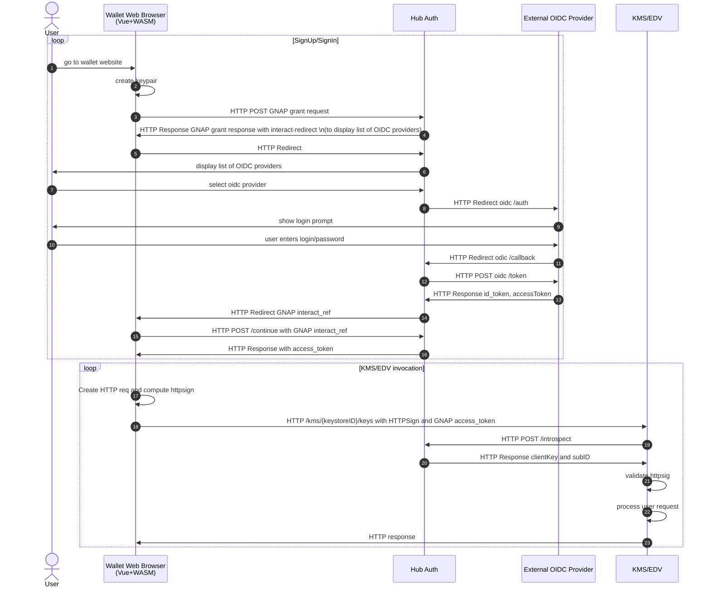

# TrustBloc Autorization 

This is a WIP design document for TrustBloc Authorization.

## Overview
The TrustBloc plans to use [[IETF-DRAFT] Grant Negotiation and Authorization Protocol (GNAP)](https://www.ietf.org/archive/id/draft-ietf-gnap-core-protocol-09.html) to authorize interactions between different components.

## Sequence Diagram

