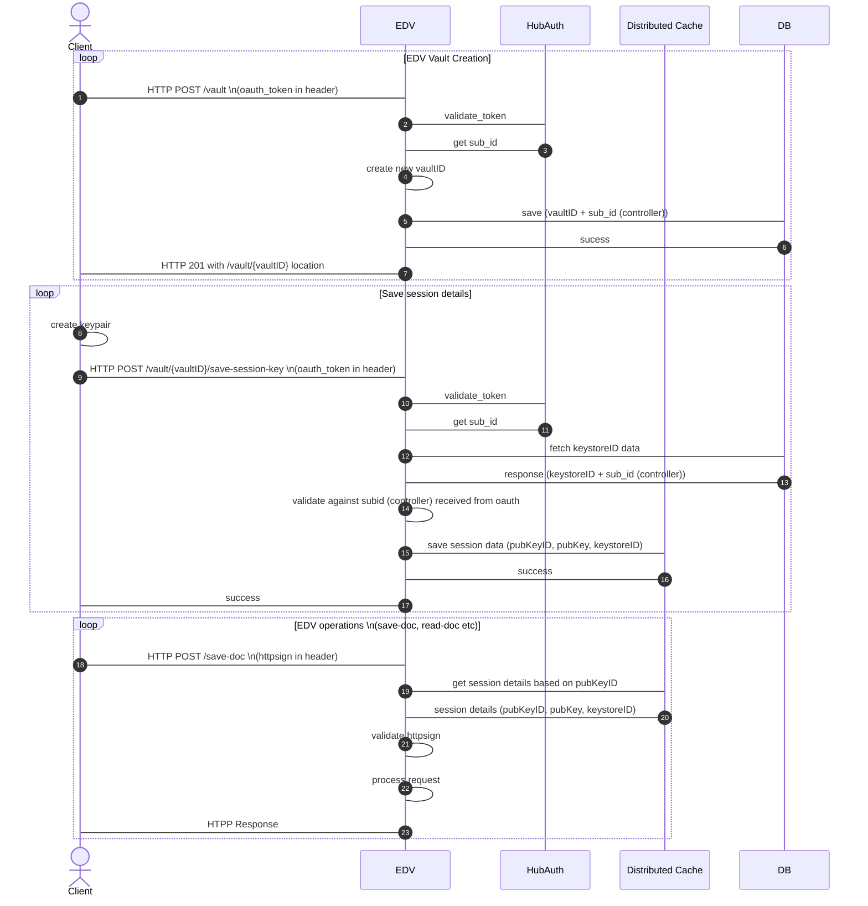

# TrustBloc EDV 

This is a WIP design document of TrustBloc Encrypted Data Vault (EDV) component.

## Authorization

```mermaid
sequenceDiagram
    autonumber
    actor client as Client
    participant edv as EDV
    participant auth as HubAuth
    participant cache as Distributed Cache 
    participant db as DB 
    
    loop EDV Vault Creation
    client -> edv : HTTP POST /vault \n(oauth_token in header)
    edv -> auth : validate_token
    auth -> edv : get sub_id
    edv -> edv : create new vaultID
    edv -> db : save (vaultID + sub_id (controller))
    db -> edv : sucess
    edv -> client :HTTP 201 with /vault/{vaultID} location
    end
    
    loop Save session details
    client -> client : create keypair
    client -> edv : HTTP POST /vault/{vaultID}/save-session-key \n(oauth_token in header)
    edv -> auth : validate_token
    auth -> edv : get sub_id
    edv -> db : fetch keystoreID data
    db -> edv : response (keystoreID + sub_id (controller))
    edv -> edv : validate against subid (controller) received from oauth
    edv -> cache : save session data (pubKeyID, pubKey, keystoreID)
    cache -> edv : success
    edv -> client : success
    end
    
    loop EDV operations \n(save-doc, read-doc etc)
    client -> edv : HTTP POST /save-doc \n(httpsign in header)
    edv -> cache : get session details based on pubKeyID
    cache -> edv : session details (pubKeyID, pubKey, keystoreID)
    edv -> edv : validate httpsign
    edv -> edv : process request
    edv -> client :HTPP Response
    end
```