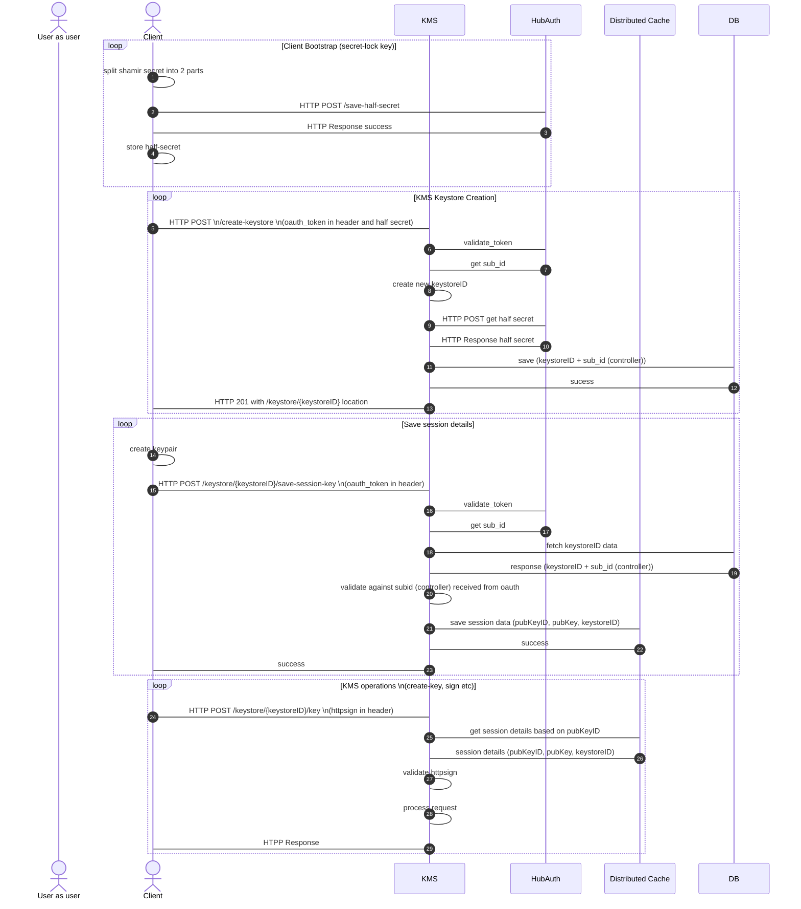

# TrustBloc KMS 

This is a WIP design document of TrustBloc Key Management Server (KMS) component.

## Authorization

```mermaid
sequenceDiagram
    autonumber
    actor user as User as user
    autonumber
    actor client as Client
    participant kms as KMS
    participant auth as HubAuth
    participant cache as Distributed Cache 
    participant db as DB 
    
    loop Client Bootstrap (secret-lock key)
    client -> client : split shamir secret into 2 parts
    client -> auth : HTTP POST /save-half-secret 
    auth -> client : HTTP Response success
    client -> client : store half-secret
    end
    
    loop KMS Keystore Creation
    client -> kms : HTTP POST \n/create-keystore \n(oauth_token in header and half secret)
    kms -> auth : validate_token
    auth -> kms : get sub_id
    kms -> kms : create new keystoreID
    kms -> auth : HTTP POST get half secret
    auth -> kms : HTTP Response half secret
    kms -> db : save (keystoreID + sub_id (controller))
    db -> kms : sucess
    kms -> client :HTTP 201 with /keystore/{keystoreID} location
    end
    
    loop Save session details
    client -> client : create keypair
    client -> kms : HTTP POST /keystore/{keystoreID}/save-session-key \n(oauth_token in header)
    kms -> auth : validate_token
    auth -> kms : get sub_id
    kms -> db : fetch keystoreID data
    db -> kms : response (keystoreID + sub_id (controller))
    kms -> kms : validate against subid (controller) received from oauth
    kms -> cache : save session data (pubKeyID, pubKey, keystoreID)
    cache -> kms : success
    kms -> client : success
    end 
    
    loop KMS operations \n(create-key, sign etc)
    client -> kms : HTTP POST /keystore/{keystoreID}/key \n(httpsign in header)
    kms -> cache : get session details based on pubKeyID
    cache -> kms : session details (pubKeyID, pubKey, keystoreID)
    kms -> kms : validate httpsign
    kms -> kms : process request
    kms -> client :HTPP Response
    end
```