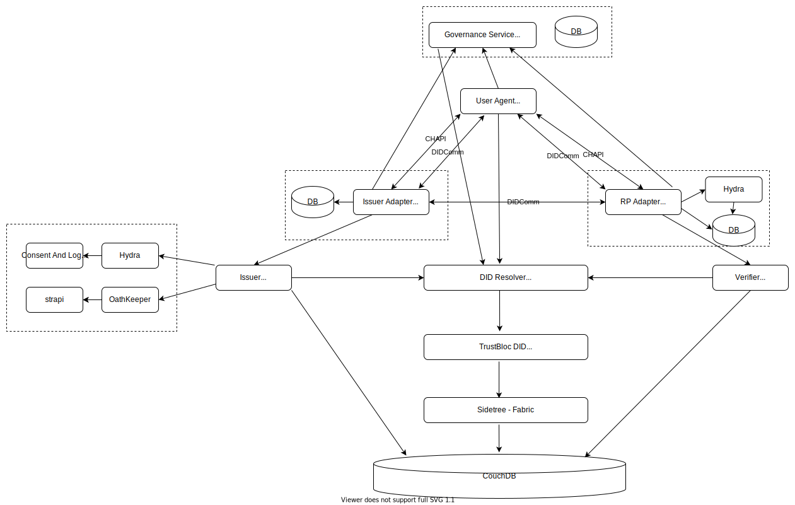
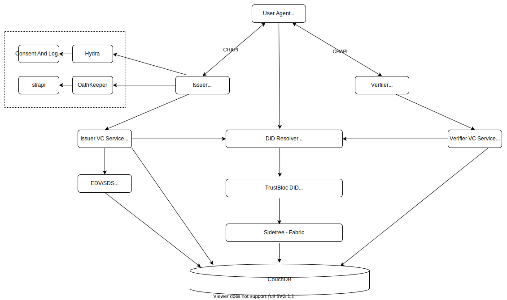

########
Adapters
########

*******************
What is an Adapter?
*******************

TrustBloc's `Edge-Adapter <https://github.com/trustbloc/edge-adapter>`__ acts as a go-between for 
Relying Party and Issuer components to support DIDComm operations. 

RP Adapter
==========

The Relying Party (RP) Adapter enables standard OpenID Connect flows on top of DIDComm.

Configuring the RP Adapter
--------------------------
TODO

Deploying the RP Adapter
------------------------

`Integration guide <https://github.com/trustbloc/edge-adapter/tree/master/docs/rp>`__

Example Request
---------------

This a combined RP example request for a Driver's License, evidence and credit score.

Issuer Adapter
==============

This component is an intermediary to act on behalf of Issuer to perform DIDComm related use cases.

Configuring the Issuer Adapter
------------------------------
TODO

Deploying the Issuer Adapter
----------------------------

`Integration guide <https://github.com/trustbloc/edge-adapter/tree/master/docs/issuer>`__

Components
===========================

DIDComm Components
------------------

Non-DIDComm Components
----------------------

Flows
=====

The Evidence and Driver's License (DL) Flow
-------------------------------------------

These components allow users to access services with a VC such as a Driver's License.
They are:

* Issuer Adapter
* RP Adapter

Combined DL, Evidence & Credit Score Flow
-----------------------------------------

This scenario shows how a person can open a bank account using both local and remote credentials.
A local credential is stored in a user's wallet while the remote credential is stored with a third-party.

In order to create the bank account, a Drivers License (local credential), Drivers Licence Evidence (remote credential)
and Credit Score (remote credential) are required.

These are issued as VCs from a `Drivers License Issuer <https://demo-issuer.sandbox.trustbloc.dev/drivinglicense>`__ and
a `Credit Score Issuer <https://demo-issuer.sandbox.trustbloc.dev/creditscore>`__.

This uses the `Non-DIDComm <https://github.com/trustbloc/edge-sandbox/blob/master/docs/demo/sandbox_nondidcomm_playground.md>`__ flow.

Watch the demo below.

.. raw:: html

         <iframe
                width="560" 
                height="315"
                src="https://www.youtube.com/embed/JNUQaOwprT8"
                frameborder="0"
                allow="accelerometer; autoplay; encrypted-media; gyroscope; picture-in-picture"
                allowfullscreen>
        </iframe>

    
