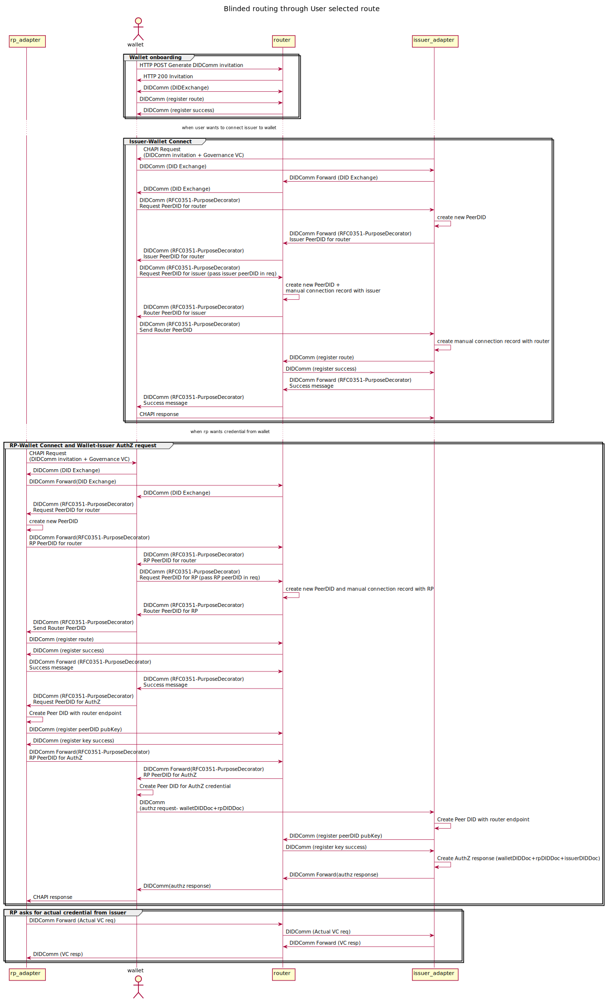

###############
Blinded Routing
###############

Introduction
************
The Issuers and RPs can use the `TrustBloc Adapters <https://trustbloc.readthedocs.io/en/latest/adapters.html>`__ to interact
with each other and with the Wallet using `DIDComm <https://github.com/hyperledger/aries-rfcs/tree/master/concepts/0005-didcomm>`__.
The RP Adapter gets data from Issuer Adapter by calling its DIDComm URL and vice versa. In some cases, the Issuer wants to hide
its identity from the RP and vice versa. The TrustBloc platforms provide Support for this through the Blinded Routing feature.

In Blinded Routing, the communication between TrustBloc Adapters (Issuer/RP) goes through the Router. The Wallet selects
a Router and facilitates the creation of DIDComm connection between the Adapter (Issuer/RP) and the Router. The Adapter
registers itself with the Router for that Adapter-Wallet combination. The DIDDocument of the Adapters would include Router's
endpoint/keys, which would be shared with other parties to create DIDComm connection with each other.

Flow Diagram
************

Components and Configurations
*****************************
- `Wallet <https://github.com/trustbloc/edge-agent/blob/master/docs/components/web_wallet.md#web-wallet-didcomm-flow-with-blinded-routing>`__
- `Router <https://github.com/trustbloc/hub-router>`__
- `Issuer Adapter <https://github.com/trustbloc/edge-adapter/blob/master/docs/issuer/issuer_integration.md#11-create-profile-api---http-post-profile>`__
- `RP Adapter <https://github.com/trustbloc/edge-adapter/blob/master/docs/rp/integration/relying_parties.md#register-your-oidc-client>`__

DIDComm Messages
****************

Wallet to Adapter : DID Doc Request
===================================
The wallet requests the adapter to provide the a new DID Document, which would be sent to Router.

Request:

.. code:: json

.. code:: json

	{
	   "@id":"089a0775-7e5f-4b96-912f-25532ec6853d",
	   "@type":"https://trustbloc.dev/blinded-routing/1.0/diddoc-req"
	}

Response:

.. code:: json

	{
	   "@id":"a8fb8f8f-4137-4e4e-9168-9b34f8d93fee",
	   "@type":"https://trustbloc.dev/blinded-routing/1.0/diddoc-resp",
	   "~thread":{
		  "thid":"089a0775-7e5f-4b96-912f-25532ec6853d"
	   },
	   "data":{
		  "errorMsg":"<inCaseOfFailure>",
		  "didDoc":{
			 <adapterDIDDoc>
		  }
	   }
	}

Wallet to Router : Create Connection
====================================
The wallet requests the router to create a new connection with the adapter, by passing adapter's DID Document. The
router creates a new connection and returns its DID Document to the wallet.

Request:

.. code:: json

	{
	   "@id":"1de30277-6849-4797-a9c3-e5f6449c9a17",
	   "@type":"https://trustbloc.dev/blinded-routing/1.0/create-conn-req",
	   "data":{
		  "didDoc":{
			 <adapterDIDDoc>
		  }
	   }
	}

Response:

.. code:: json

	{
	   "@id":"39aefb3f-562b-410d-b992-ab88e829aae9",
	   "@type":"https://trustbloc.dev/blinded-routing/1.0/create-conn-resp",
	   "data":{
		  "errorMsg":"<inCaseOfFailure>",
		  "didDoc":{
			 <routerDIDDoc>
		  }
	   }
	}

Wallet to Adapter : Route Registration
======================================
The wallet sends the router's DID Document along with Parent threadID. The threadID from
earlier DIDDoc req message from wallet to adapter will be used as parentThreadID. The Adapter creates the connection
with the router and registers with it.

Request:

.. code:: json

	{
	   "@id":"2d8ae926-111d-4970-a8b6-376991750d0f",
	   "@type":"https://trustbloc.dev/blinded-routing/1.0/register-route-req",
	   "~thread":{
		  "pthid":"089a0775-7e5f-4b96-912f-25532ec6853d"
	   },
	   "data":{
		  "didDoc":{
			 <routerDIDDoc>
		  }
	   }
	}

Response:

.. code:: json

	{
	   "@id":"c3e8dfc0-aa84-420d-87d4-2401e2c41b7b",
	   "@type":"https://trustbloc.dev/blinded-routing/1.0/register-route-resp",
	   "data":{
		  "errorMsg":"<inCaseOfFailure>"
	   }
	}
