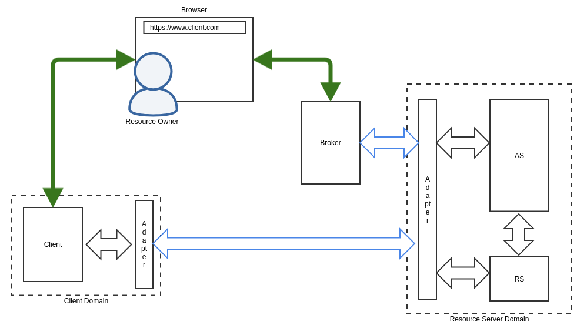

Privacy-Enhanced OAuth 2.0
==========================

**Status:** DRAFT

.. contents:: Table of Contents
    :local:
    :backlinks: top

Contributors
------------

* George Aristy (SecureKey Techologies)

Introduction
------------

Purpose of this document
^^^^^^^^^^^^^^^^^^^^^^^^

This document describes a reference implementation of OAuth 2.0 with
unregistered clients communicating and authenticating securely over the
backchannel with decentralized identifiers and verifiable credentials.

Motivation
^^^^^^^^^^

There is a desire to leverage existing OAuth 2.0 infrastructure to build a
privacy-enhanced data sharing solution.

Finalized in 2012, OAuth 2.0 ([RFC6749]_), is an established authorization
framework well suited to give a piece of software access to protected
resources with the owner's consent. It was not, however, designed with the
principles of Privacy by Design ([PRIV-DESIGN]_) in mind.

First published in 2009, the principles of privacy by design became widely
known after the GDPR adopted them ([GDPR-PRIV]_) and began enforcement in
2018. We seek to address two key principles of privacy by design that OAuth
2.0 does not:

**Protect the user's privacy by keeping the solution User-Centric**

* Use the authorization grant mechanism of OAuth 2.0 to keep the user in the
  locus of control.
* Use decentralized identifiers (DIDs) ([DID-CORE]_) so the user (and the other
  actors) can avoid undesired correlation.

**Protect the user's privacy with end-to-end security**

* Use end-to-end authenticated encryption of the messages and data while in
  transit.

Objectives
^^^^^^^^^^

#. Allow a client to request the user for access to resources hosted on a resource server.
#. Conceal the client's location from the resource server's location (and vice versa).
#. Allow the user to grant the client access to the resources.
#. Allow the user to revoke access to the client.
#. Allow the user to indicate the location of these resources to the client.
#. Minimize exposure of the client's identity from the resource server (and vice versa).
#. Ensure confidentiality in communications through the frontchannel.
#. Ensure confidentiality in communications through the backchannel.

Constraints
^^^^^^^^^^^

#. Use OAuth 2.0 (authorization code grant type).
#. No modification of OAuth components in client nor resource server domains.
#. Use decentralized identifiers.

System Overview
---------------

 
    System Overview

    - Green arrows indicate frontchannel communication.
    - Blue arrows indicate backchannel communication over a secure transport.
    - Black arrows indicate backchannel communication in their normal (HTTP) form.

The figure above shows the main components of the system. It depicts a normal
OAuth 2 setup with the client, resource owner, authorization server and
resource server roles but adds two new components:

**Broker:**

OAuth 2.0 requires clients to be registered at the authorization server
[#f1]_ before sending the authorization request. Our objectives preclude
this, therefore the user requires a "broker" component that will relay the
authorization request appropriately and to the right location.

**Adapter:**

The adapters pack and unpack normal authorization requests, token
exchange/refresh requests, and requests to the resources to and from HTTP
transport and secure, end-to-end encrypted channels between the user, client,
and server domains. They also isolate the OAuth 2 components in the client
and server domains from the complexity of the network.

.. rubric:: Footnotes

.. [#f1] As per section 2.4 of [RFC6749]_ , unregistered clients are out of scope but not precluded by the OAuth2 specification. However, it is difficult to reconcile this in a meaningful way with the fact that authorization servers assign the `client_id` to clients (section 2.2) to ensure their uniqueness so as to avoid impersonation attacks (see section 4.13 of [O2-BCP]_ ).

References
----------

Normative References
^^^^^^^^^^^^^^^^^^^^

.. [RFC6749] D. Hardt (Microsoft), `"IETF RFC6749 - The OAuth 2.0 Authorization Framework" <https://tools.ietf.org/html/rfc6749>`_,
          October 2012

.. [O2-BCP] T. Lodderstedt (yes.com), J. Bradley (Yubico), A. Labunets (Facebook), D. Fett (yes.com), `"OAuth 2.0 Security Best Current Practice" <https://tools.ietf.org/html/draft-ietf-oauth-security-topics-13>`_, version 13.

.. [DID-CORE] Drummond Reed (Evernym), Manu Sporny (Digital Bazaar), Markus Sabadello (Danube Tech), Dave Longley (Digital Bazaar), Christopher Allen (Blockchain Commons), Ryan Grant, `"Decentralized Identifiers (DIDs) v1.0" <https://w3c.github.io/did-core/>`_,  W3C Working Draft 10 December 2019

Informative References
^^^^^^^^^^^^^^^^^^^^^^

.. [PRIV-DESIGN] Ann Cavoukian (Information & Privacy Commissioner of Ontario, Canada), `"Privacy by Design - The 7 Foundational Principles" <https://www.ipc.on.ca/wp-content/uploads/Resources/7foundationalprinciples.pdf>`_, Retrieved December 10 2019

.. [GDPR-PRIV] European Data Protection Supervisor, `"Preliminary Opinion on privacy by design" <https://edps.europa.eu/sites/edp/files/publication/18-05-31_preliminary_opinion_on_privacy_by_design_en_0.pdf>"`_, May 31 2018
