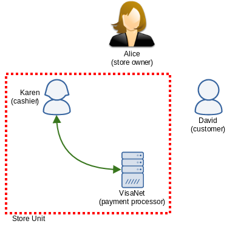
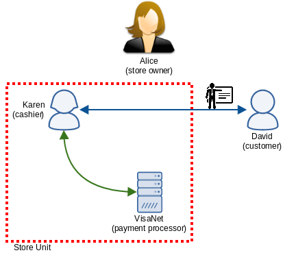

Trusted Contexts via DIDComm
============================

Summary
-------

This paper highlights the conceptual gaps between the existing Aries credentials exchange model
where the User is the Holder of the credentials being requested, and the TrustBloc model where the
User is not the Holder, yet retains authority over the issuance of these credentials. It introduces
new concepts to bridge these gaps that build upon existing Aries protocols and ideas.

Motivation
----------

The fundamental difference between the :ref:`trusted_contexts` model of user data exchange and the
Aries model is that the User is not the Holder nor the Issuer of data in *Trusted Contexts*. Just
like the Aries model however, the User remains in the locus of control. In other words, the user
*authorizes* the issuance of verifiable credentials of which they are the subject.

Trusted Contexts give the user control over *who* has access to *what* and *when*. This requires a
mechanism for **authorization** - a concept not found in Aries. In fact, the Trusted Contexts model
is more akin to the Kantara Initiative's UMA model [#f1]_.

At the same time, there are concerns over the overhead of Aries' protocols: performance of a
data-exchange network is expected to degrade significantly if multiple request-response cycles are
spawned per single request for data. Minimizing this overhead is highly desirable, and key to
achieving acceptable latencies and throughputs that will further enable widespread use of this
technology.

Extending Aries
---------------

The 'Introduce' Protocol
^^^^^^^^^^^^^^^^^^^^^^^^^^^^^

[TODO figure out a better term for 'Consent Checker']

**The Introducer needs to define the roles in the relationships they are creating.**

When the Introducer [#f2]_ has a vested interest in the relationship they are enabling, they typically
assign roles to the *introducees* such that transactions may occur in some orderly fashion.

For example, a small over-the-counter store would have the roles of *cashier* and *payment
processor*. The payment processor is an automated processor like VisaNet and the cashier is a person
hired by the owner. The cashier was introduced to the payment processor during on-the-job training.
To complete the transaction:

1. The customer sends payment to the processor
2. The payment processor notifies the cashier of a successful payment event
3. The cashier prints out a receipt and hands it to the customer

This sequence of events is unavoidable and must be executed in this same order for the transaction
to be completed.

Similarly, Trusted Contexts define the roles of *User*, *Issuer*, *Relying Party*, and the *Consent
Checker*.  In the latter case, the User introduces the Issuer or Relying Party to the User's chosen
Consent Checker. The Issuer cannot share user data without prior validation of the user's consent.

**The Introducer needs to correlate several introductions as part of the same context.**

The Introducer does not need to introduce all parties to each other in a group. The only
introductions of interest are those between *units* in the group.

Units can be thought of as a subdivision within the group composed of N parties that together act as
a unit from the point of view of the rest of the group, similar to the cashier and payment processor
above:

   Cashier and the payment processor introduced first (green).

The Introducer can build upon the first units by creating connections ("introducing") between them.
The roles established in the previous round of introductions are carried forth into this new round:

   The Store Unit is introduced to the Customer, with the Cashier exposing her role as cashier and
   the processor as the payment processor, and the steps to complete the transaction are set up a
   priori.

Thus this second round of introductions retains the context of the first round.

The concept of Units does not require new constructs in the existing Aries protocols to work. They
can be modelled as a sequence of Agents where one acts as the point of entry to the unit -
leveraging the concept of "gatekeeping" [#f3]_ - and the whole unit can be presented to other parties
in the form of a single DID document following current DIDDoc conventions for routing [#f4]_.

Cross Domain Messaging
^^^^^^^^^^^^^^^^^^^^^^

**The Relying Party needs to send several messages to a Unit in a single request.**

Each constituent Agent of a unit needs appropriate inputs in order to function.

The simple sales example defines the Seller unit with the payment processor transparently processing
the customer's payment without the cashier seeing the inputs. The cashier merely waits for the
successful payment notification from the processor before printing out a receipt for the customer.
In this flow we have:

* A message intended for the cashier (the items and their quantities)
* A message for the payment processor (the credit card info)

Similarly, in Trusted Contexts we have:

* A request message for the Issuer
* A consent record for the Consent Checker

These messages *could* be delivered in a roundabout way by having separate request-response cycles
for each leg of the transaction. For example, in the sales scenario:

* Customer gives the payment to the payment processor
* Customer receives a confirmation from the processor
* Customer hands the confirmation to the cashier
* Cashier issues receipt to the customer

But instead what happens is:

* Customer gives the payment to the payment processor
* Payment processor notifies cashier
* Cashier issues receipt to the customer

This streamlined protocol is prompted by the need for efficiency in transactions.

.. rubric:: Footnotes

.. [#f1] `User-Managed Access <https://kantarainitiative.org/confluence/display/uma/Home>`_ gives the User a unified control point for authorizing access to their resources, with `delegated access management to custodians under consideration <https://kantarainitiative.org/confluence/display/uma/UMA+Scenarios+and+Use+Cases#UMAScenariosandUseCases-scenario-custodianScenario:DelegatingAccessManagementtoCustodians(Pending)>`_
.. [#f2] `Aries RFC 0028 - Introduce Protocol <https://github.com/hyperledger/aries-rfcs/blob/master/features/0028-introduce/README.md>`_ enables an Introducer to bootstrap the `DID Exchange protocol <https://github.com/hyperledger/aries-rfcs/blob/master/features/0023-did-exchange/README.md>`_ between two other parties without further participation by the Introducer.
.. [#f3] `Aries RFC 0046 - Mediators and Relays <https://github.com/hyperledger/aries-rfcs/blob/master/concepts/0046-mediators-and-relays/README.md>`_ defines Mediators as *active participants* in agent-to-agent message delivery. Specifically, Scenario 2 shows a mediator acting as a gatekeeper, forwarding only important messages that should reach the final recipient.
.. [#f4] `Aries RFC 0067 - DIDComm DID document conventions <https://github.com/hyperledger/aries-rfcs/blob/master/features/0067-didcomm-diddoc-conventions/README.md>`_ defines conventions for coding message routing information in DID documents.

