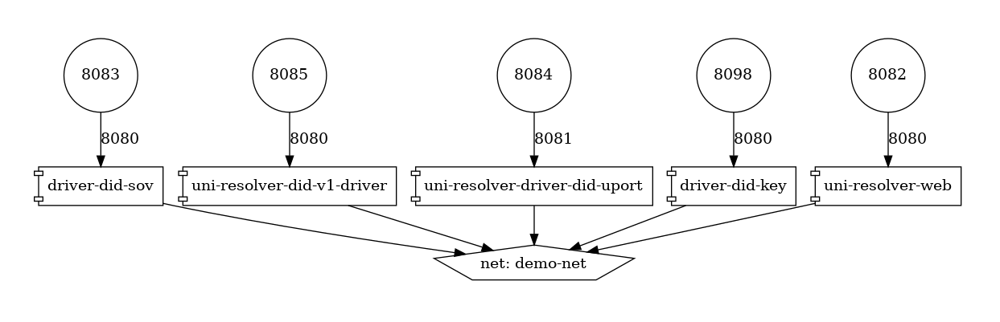
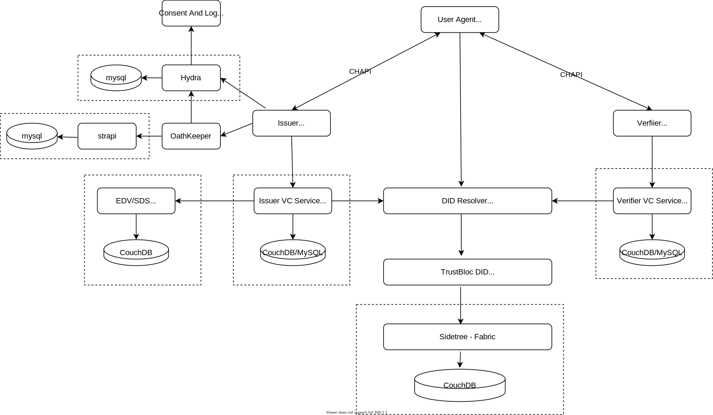

###################################
Verifiable Credential Service (VCS)
###################################

What is a Verifiable Credential (VC)?
*************************************

We use credentials everyday. A driver's license issued by the government certify
that we are capable of operating a vehicle on the road. A Permanent Residence card
shows the immigration status of an individual.

A verifiable credential is then a document whose contents can be cryptographically proven/verified (VC-TERM_) to be true.
A VC could hold the same data that a physical credential does.
Within the scope of TrustBloc projects, this act of verifying credentials can be done with the aid
of technology such as digital identities and signatures. The use of digital signatures adds to the integrity
of a credential when it is presented.

Holders of verifiable credentials can generate verifiable presentations and then share these
verifiable presentations with verifiers to prove they possess verifiable credentials with certain characteristics.
Both verifiable credentials and verifiable presentations can be transmitted rapidly, making them more convenient
than their physical counterparts when trying to establish trust at a distance. (VC-DEF_)

Edge-Service
************

TrustBloc's `Edge-Service <https://github.com/trustbloc/edge-service>`__ contains servers that handle the issuance and verification of verifiable credentials.

Configuring the service
=======================

Edge-Service can be used in the following modes:

* Issuer
* Verifier
* Holder
* Governance

`Get vcs-rest from GitHub packages <https://github.com/trustbloc/edge-service/packages>`__.

Configuration flags for the server::

      Start vc-rest inside the edge-service

      Usage:
         vc-rest start [flags]

      Flags:
               --api-token string                     Check for bearer token in the authorization header (optional). Alternatively, this can be set with the following environment variable: VC_REST_API_TOKEN
         -f, --backoff-factor string                If no VC is found when attempting to retrieve a VC from the EDV, this is the factor to increase the time to wait for subsequent retries after the first. Alternatively, this can be set with the following environment variable: BACKOFF-FACTOR
         -b, --bloc-domain string                   Bloc domain
               --database-prefix string               An optional prefix to be used when creating and retrieving underlying databases. Alternatively, this can be set with the following environment variable: DATABASE_PREFIX
         -t, --database-type string                 The type of database to use for everything except key storage. Supported options: mem, couchdb. Alternatively, this can be set with the following environment variable: DATABASE_TYPE
         -v, --database-url string                  The URL of the database. Not needed if using memstore. For CouchDB, include the username:password@ text if required. Alternatively, this can be set with the following environment variable: DATABASE_URL
         -e, --edv-url string                       URL EDV instance is running on. Format: HostName:Port.
               --governance-claims-file string        Path to governance claimsAlternatively, this can be set with the following environment variable: VC_REST_GOVERNANCE_CLAIMS_FILE
         -h, --help                                 help for start
         -u, --host-url string                      URL to run the vc-rest instance on. Format: HostName:Port.
         -x, --host-url-external string             Host External Name:Port This is the URL for the host server as seen externally. If not provided, then the host url will be used here. Alternatively, this can be set with the following environment variable: VC_REST_HOST_URL_EXTERNAL
         -i, --initial-backoff-millisec string      If no VC is found when attempting to retrieve a VC from the EDV, this is the time to wait (in milliseconds) before the first retry attempt. Alternatively, this can be set with the following environment variable: INITIAL_BACKOFF_MILLISEC
               --kms-secrets-database-prefix string   An optional prefix to be used when creating and retrieving the underlying KMS secrets database. Alternatively, this can be set with the following environment variable: KMSSECRETS_DATABASE_PREFIX
         -k, --kms-secrets-database-type string     The type of database to use for storage of KMS secrets. Supported options: mem, couchdb. Alternatively, this can be set with the following environment variable: KMSSECRETS_DATABASE_TYPE
         -s, --kms-secrets-database-url string      The URL of the database. Not needed if using memstore. For CouchDB, include the username:password@ text if required. It's recommended to not use the same database as the one set in the database-url flag (or the DATABASE_URL env var) since having access to the KMS secrets may allow the host of the provider to decrypt EDV encrypted documents. Alternatively, this can be set with the following environment variable: DATABASE_URL
         -l, --log-level string                     Logging level to set. Supported options: CRITICAL, ERROR, WARNING, INFO, DEBUG.Defaults to info if not set. Setting to debug may adversely impact performance. Alternatively, this can be set with the following environment variable: LOG_LEVEL
         -a, --max-retries string                   If no VC is found when attempting to retrieve a VC from the EDV, this is the maximum number of times to retry retrieval. Defaults to 5 if not set. Alternatively, this can be set with the following environment variable: MAX-RETRIES
         -m, --mode string                          Mode in which the vc-rest service will run. Possible values: ['issuer', 'verifier', 'holder', 'combined'] (default: combined).
               --request-tokens stringArray           Tokens used for http request Alternatively, this can be set with the following environment variable: VC_REST_REQUEST_TOKENS
               --tls-cacerts stringArray              Comma-Separated list of ca certs path.Alternatively, this can be set with the following environment variable: VC_REST_TLS_CACERTS
               --tls-systemcertpool string            Use system certificate pool. Possible values [true] [false]. Defaults to false if not set. Alternatively, this can be set with the following environment variable: VC_REST_TLS_SYSTEMCERTPOOL
         -r, --universal-resolver-url string        Universal Resolver instance is running on. Format: HostName:Port.

Example: Running in Issuer Mode
-------------------------------

The following is a snippet of a Docker Compose :superscript:`TM` file showing how Edge Service can be configured.
It makes use of environment variables declared `here <https://github.com/trustbloc/edge-sandbox/blob/master/test/bdd/fixtures/demo/.env>`__.

.. code:: yaml

  issuer.vcs.example.com:
    container_name: issuer.vcs.example.com
    image: ${VCS_IMAGE}:${VCS_IMAGE_TAG}
    environment:
      - VC_REST_HOST_URL=0.0.0.0:8070
      - VC_REST_HOST_URL_EXTERNAL=https://issuer-vcs.trustbloc.local
      - EDV_REST_HOST_URL=https://edv.trustbloc.local/encrypted-data-vaults
      - BLOC_DOMAIN=${BLOC_DOMAIN}
      - UNIVERSAL_RESOLVER_HOST_URL=https://did-resolver.trustbloc.local/1.0/identifiers
      - VC_REST_MODE=issuer
      - DATABASE_TYPE=couchdb
      - DATABASE_URL=${COUCHDB_USERNAME}:${COUCHDB_PASSWORD}@shared.couchdb:5984
      - DATABASE_PREFIX=issuer
      - KMSSECRETS_DATABASE_TYPE=couchdb
      - KMSSECRETS_DATABASE_URL=${COUCHDB_USERNAME}:${COUCHDB_PASSWORD}@shared.couchdb:5984
      - KMSSECRETS_DATABASE_PREFIX=issuer
      - VC_REST_TLS_CACERTS=/etc/tls/trustbloc-dev-ca.crt
      - VC_REST_TLS_SYSTEMCERTPOOL=true
      - VC_REST_API_TOKEN=vcs_issuer_rw_token
      - VIRTUAL_HOST=issuer-vcs.trustbloc.local
    ports:
      - 8070:8070
    entrypoint: ""
    # wait 20 seconds for couchdb to start
    command:  /bin/sh -c "sleep 20;/tmp/scripts/vcs_configure.sh& vc-rest start"
    volumes:
      - ../scripts/:/tmp/scripts #https://github.com/trustbloc/edge-sandbox/tree/master/test/bdd/fixtures/scripts
      - ../keys/tls:/etc/tls
    depends_on:
      - edv.example.com
    networks:
      - demo-net

  edv.example.com:
    container_name: edv.example.com
    image: ${EDV_IMAGE}:${EDV_IMAGE_TAG}
    environment:
      - EDV_HOST_URL=0.0.0.0:8081
      - EDV_DATABASE_TYPE=couchdb
      - EDV_DATABASE_URL=${COUCHDB_USERNAME}:${COUCHDB_PASSWORD}@shared.couchdb:5984
      - EDV_DATABASE_PREFIX=edv
      - VIRTUAL_HOST=edv.trustbloc.local
    ports:
      - 8081:8081
    command: start
    networks:
      - demo-net

Examples of how the other modes can be configures is available in the following repos:

* `edge-sandbox <https://github.com/trustbloc/edge-sandbox/blob/master/test/bdd/fixtures/demo/docker-compose-edge-components.yml>`__
* `edge-service <https://github.com/trustbloc/edge-service/blob/master/test/bdd/fixtures/vc-rest/docker-compose.yml>`__

Deploying the service
======================

In order to deploy Edge-Service, the following components are required.

.. note::
      An example of how these components interact together is shown `here <https://github.com/trustbloc/edge-sandbox/tree/master/test/bdd/fixtures/demo>`__.

Sidetree
--------

Sidetree Fabric
^^^^^^^^^^^^^^^

.. image:: images/sandbox-deployment/docker-compose-sidetree-fabric.yml.png

Sidetree Mock
^^^^^^^^^^^^^

.. image:: images/sandbox-deployment/docker-compose-sidetree-mock.yml.png

Edge Components 
---------------

.. image:: images/sandbox-deployment/docker-compose-edge-components.yml.png

DID Resolvers
---------------

DID Registrars
--------------

.. image:: images/sandbox-deployment/docker-compose-universal-registrar.yml.png

VCS Components (CHAPI + VC Services)
====================================

Issuing a VC
============

In order to issue a Verifiable Credential, you will need to first create a profile.

1. Issue a VC
-------------

**HTTP POST /{profile}/credentials/issueCredential**

.. code:: json

   {
      "credential":{
         "@context":[
            "https://www.w3.org/2018/credentials/v1"
         ],
         "id":"http://example.edu/credentials/1872",
         "type":"VerifiableCredential",
         "credentialSubject":{
            "id":"did:example:ebfeb1f712ebc6f1c276e12ec21"
         },
         "issuer":{
            "id":"did:example:76e12ec712ebc6f1c221ebfeb1f",
            "name":"Example University"
         },
         "issuanceDate":"2010-01-01T19:23:24Z",
         "credentialStatus":{
            "id":"https://example.gov/status/24",
            "type":"CredentialStatusList2017"
         }
      },
      "options":{
         "assertionMethod":"did:trustbloc:testnet.trustbloc.local:EiAiijiRNEAflOr6ZOJN5A7BCFQD1pwFMI1MPzHr3bXezg=="
      }
   }

More details `here <https://github.com/trustbloc/edge-service/blob/master/docs/vc-rest/api_overview.md#3-issue-verifiable-credential---post-profilecredentialsissuecredential>`__.

Try it `here <https://w3c-ccg.github.io/vc-http-api/#/Issuer/issueCredential>`__.

2. Compose and Issue a VC
-------------------------

**HTTP POST /{profile}/credentials/composeAndIssueCredential**

.. code:: json

   {
      "issuer":"did:example:uoweu180928901",
      "subject":"did:example:oleh394sqwnlk223823ln",
      "types":[
         "UniversityDegree"
      ],
      "issuanceDate":"2020-03-25T19:38:54.45546Z",
      "expirationDate":"2020-06-25T19:38:54.45546Z",
      "claims":{
         "name":"John Doe"
      },
      "evidence":{
         "id":"http://example.com/policies/credential/4",
         "type":"IssuerPolicy"
      },
      "termsOfUse":{
         "id":"http://example.com/policies/credential/4",
         "type":"IssuerPolicy"
      },
      "proofFormat":"jws",
      "proofFormatOptions":{
         "kid":"did:trustbloc:testnet.trustbloc.local:EiAtPEWAphdPVRxlKpr8N43uyLMhgF-9SFmYfINVpDIzUA==#key-1"
      }
   }

More details `here <https://github.com/trustbloc/edge-service/blob/master/docs/vc-rest/api_overview.md#4-compose-and-issue-verifiable-credential---post-profilecredentialscomposeandissuecredential>`__.

Validating a VC
===============

**HTTP POST /verifier/credentials**

.. code:: json

   {
      "verifiableCredential":{
         "@context":[
            "https://www.w3.org/2018/credentials/v1",
            "https://www.w3.org/2018/credentials/examples/v1"
         ],
         "credentialSchema":[

         ],
         "credentialStatus":{
            "id":"http://issuer.vc.rest.example.com:8070/status/1",
            "type":"CredentialStatusList2017"
         },
         "credentialSubject":{
            "degree":{
               "degree":"MIT",
               "type":"BachelorDegree"
            },
            "id":"did:example:ebfeb1f712ebc6f1c276e12ec21",
            "name":"Jayden Doe",
            "spouse":"did:example:c276e12ec21ebfeb1f712ebc6f1"
         },
         "id":"http://example.gov/credentials/3732",
         "issuanceDate":"2020-03-16T22:37:26.544Z",
         "issuer":{
            "id":"did:example:oakek12as93mas91220dapop092",
            "name":"University"
         },
         "proof":{
            "created":"2020-04-09T15:35:35Z",
            "jws":"eyJhbGciOiJFZERTQSIsImI2NCI6ZmFsc2UsImNyaXQiOlsiYjY0Il19..kN1srfFqoiejHJwxM8Y0Y9yIonAvFeF2Aoiv6_LTkPqcNXc2rXwT94-uO_PQJbxWJgTD78MvpfCJWsUSRvgCBw",
            "proofPurpose":"assertionMethod",
            "type":"Ed25519Signature2018",
            "verificationMethod":"did:trustbloc:testnet.trustbloc.local:EiD3KVRkHAHt6aLO4Kp5PSO3pNhAY_GPZXuKUekVk1uboQ==#key-1"
         },
         "type":[
            "VerifiableCredential",
            "UniversityDegreeCredential"
         ]
      },
      "options":{
         "checks":[
            "proof"
         ]
      }
   }

More details `here <https://github.com/trustbloc/edge-service/blob/master/docs/vc-rest/api_overview.md#1-verify-credential---post-verifiercredentials>`__.

Try it `here <https://w3c-ccg.github.io/vc-http-api/#/Verifier/verifyCredential>`__.

Connecting to the TestNet
*************************
TODO

Using Edge-Service
******************

To use the demo, navigate to the `Demo Issuer <https://demo-issuer.sandbox.trustbloc.dev>`__ homepage.

Then follow the steps in the videos below for their respective demonstrations.

These demos make use of `Edge-Sandbox <https://github.com/trustbloc/edge-sandbox>`__ which is a demo environment for edge-service.

Register A Wallet
=================

Be sure to register your wallet as in the video below:

.. raw:: html

         <iframe
                width="560"
                height="315"
                src="https://www.youtube.com/embed/-F9XOVJtWVs"
                frameborder="0"
                allow="accelerometer; autoplay; encrypted-media; gyroscope; picture-in-picture"
                allowfullscreen>
        </iframe>

Issue a Credit Score Report
===========================

.. raw:: html

         <iframe
                width="560"
                height="315"
                src="https://www.youtube.com/embed/X2i1mwyryYc"
                frameborder="0"
                allow="accelerometer; autoplay; encrypted-media; gyroscope; picture-in-picture"
                allowfullscreen>
        </iframe>

Issue a Driver's License
========================

.. raw:: html

         <iframe
                width="560"
                height="315"
                src="https://www.youtube.com/embed/Riv48wZuAcM"
                frameborder="0"
                allow="accelerometer; autoplay; encrypted-media; gyroscope; picture-in-picture"
                allowfullscreen>
        </iframe>

References
**********

.. [VC-DEF] Manu Sporny; Grant Noble; Dave Longley; David Chadwick, `"Verifiable Credentials Data Model 1.0" <https://www.w3.org/TR/vc-data-model/#what-is-a-verifiable-credential>`_,
          November 2019

.. [VC-TERM] Manu Sporny; Grant Noble; Dave Longley; David Chadwick, `"Verifiable Credentials Data Model 1.0" <https://www.w3.org/TR/vc-data-model/#terminology>`_,
          November 2019
